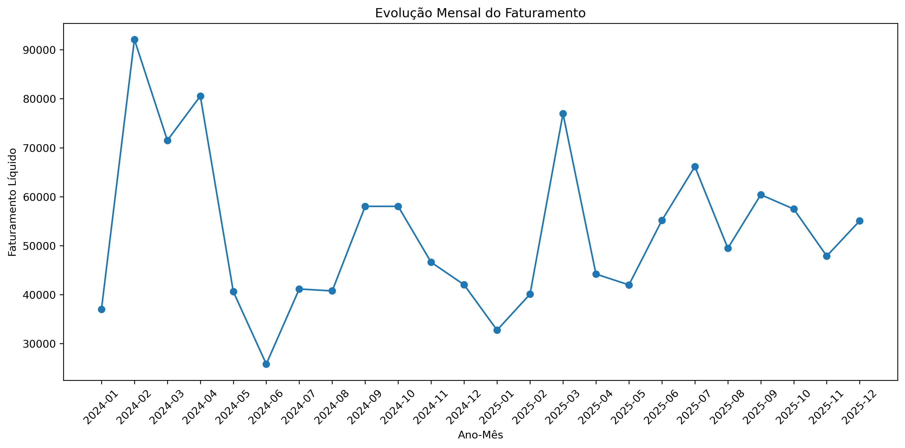

# Análise de Dados de Vendas com Python

## Visão Geral

Este projeto analisa uma base de dados de vendas no varejo utilizando Python.
O foco principal está na limpeza de dados, engenharia de atributos, geração de insights de negócio e visualização de dados.

A base contém inconsistências intencionais para simular cenários reais encontrados no mercado.

---

## Objetivos

* Limpar e preparar dados brutos de vendas
* Tratar duplicidades, valores ausentes e registros inválidos
* Calcular faturamento bruto e líquido
* Analisar desempenho por categoria, produto, região e período
* Criar visualizações claras para apoio à tomada de decisão

---

## Tecnologias Utilizadas

* Python 3.12+
* Pandas
* Matplotlib
* Jupyter Notebook

---

## Colunas da Base de Dados

* id_venda
* data
* cliente
* produto
* categoria
* quantidade
* preco_unitario
* regiao
* canal_venda
* desconto

---

## Processo de Limpeza de Dados

Os seguintes problemas foram identificados e corrigidos:

* Linhas duplicadas
* Valores ausentes
* Datas inválidas
* Quantidades negativas
* Preços negativos
* Percentuais de desconto inválidos
* Formatação inconsistente de texto
* Inconsistências nos nomes das categorias

---

## Métricas Criadas

* Faturamento Bruto
* Valor de Desconto
* Faturamento Líquido
* Faturamento Mensal
* Receita dos Produtos Mais Vendidos
* Faturamento por Região

---

## Visualizações

O projeto inclui:

* Faturamento por Categoria
* Tendência Mensal de Faturamento
* Top 10 Produtos por Faturamento
* Faturamento por Região

---
## Exemplos Visuais



---
## Principais Insights

* A categoria de eletrônicos liderou o faturamento total.
* A região Sudeste apresentou melhor desempenho.
* O mês de Janeiro de 2024 registrou pico de vendas.
* O mês de Junho de 2024 registrou o pior momento de vendas.
* Alguns produtos possuem baixa representatividade e podem ser reavaliados.

---

## Estrutura do Projeto

```text
data/
graficos/
src/
README.md
requirements.txt
```

---

## Como Executar

```bash
pip install -r requirements.txt
jupyter notebook
```

---

## Autor

Lucas Oto
